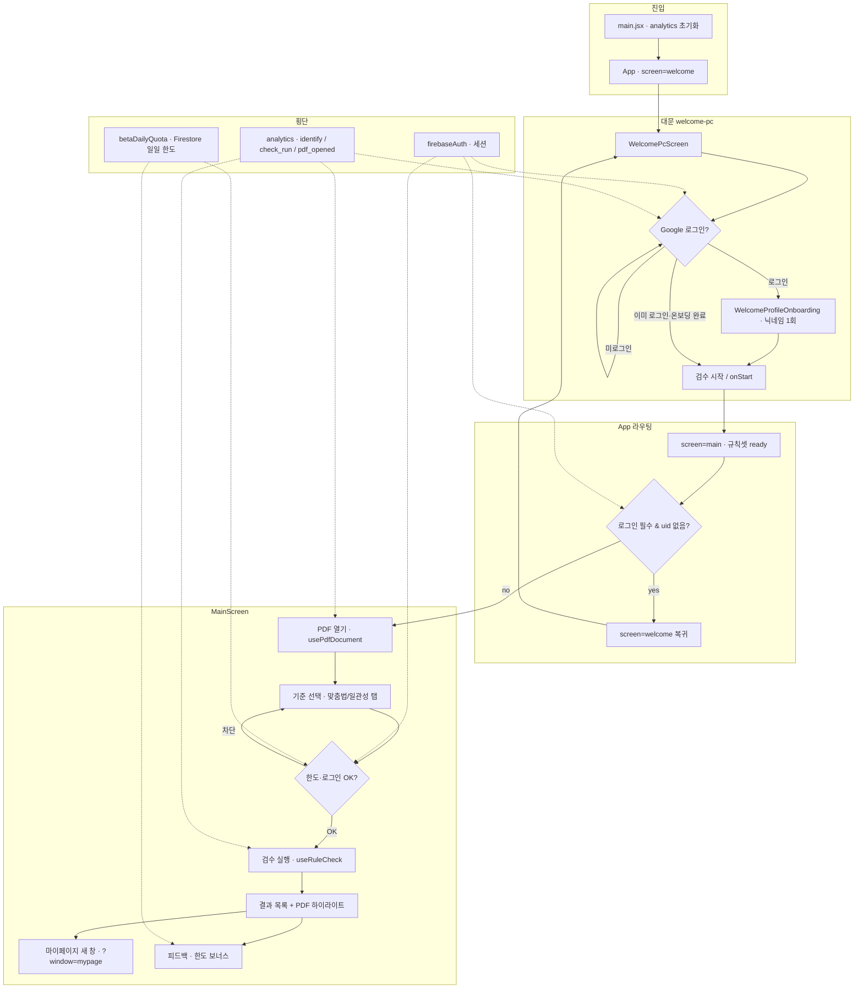
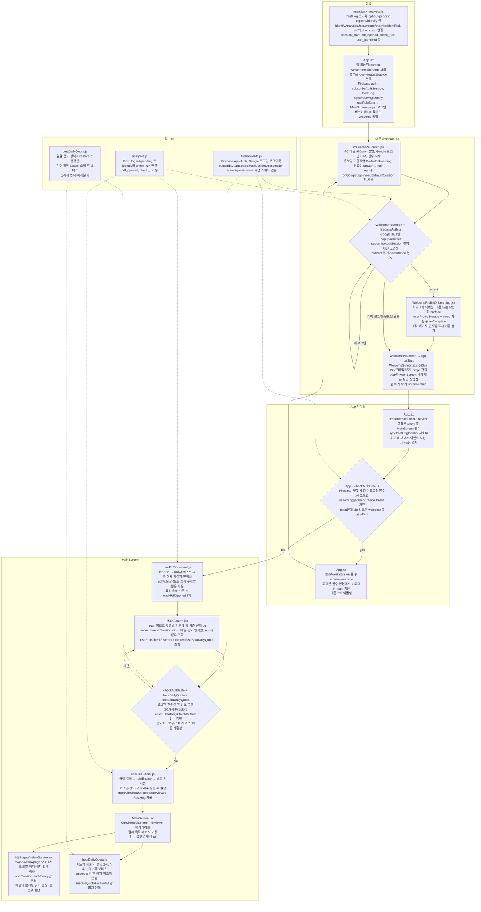
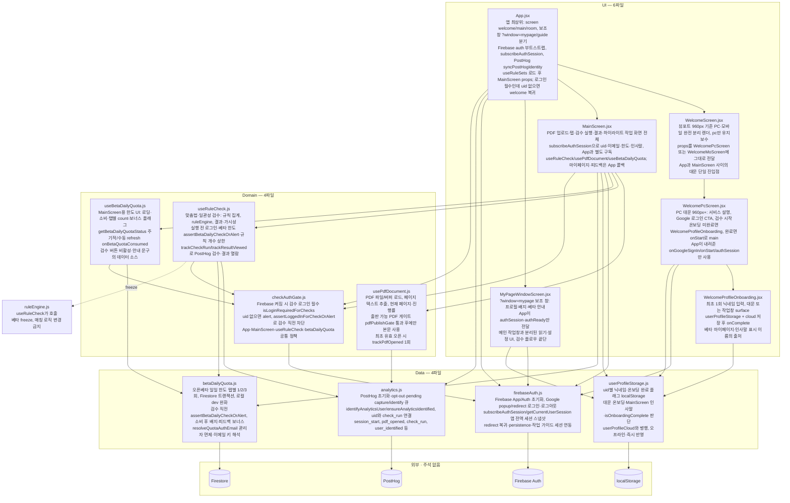
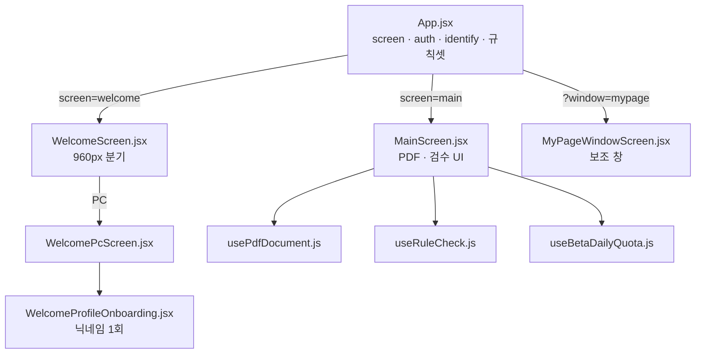
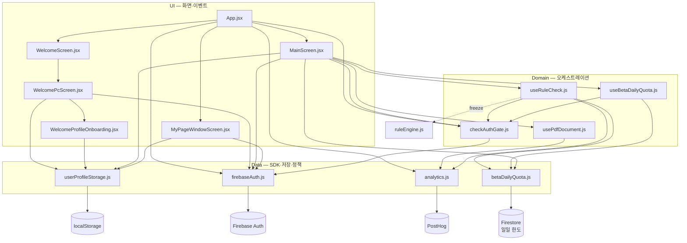
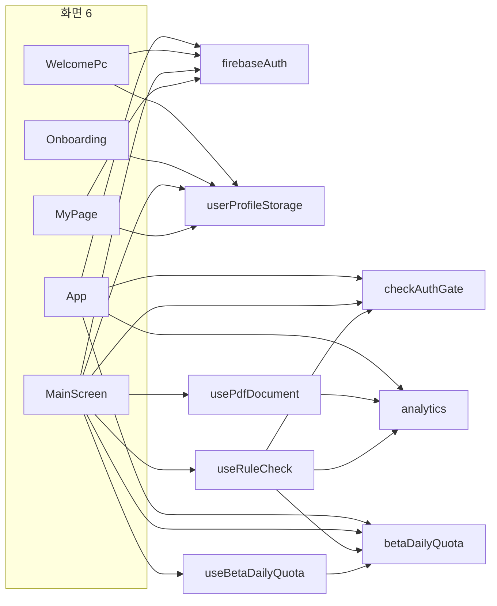

# 구조 지도 (structure.md)

**용도:** Cursor·본인 공용 **지도**. 코드 전체가 아니라 **베타 핵심 경로**만 담는다.  
**워크스페이스:** `pdf-publish-proofread` (PC worktree)  
**갱신:** 2026-06-05 — 1~4단계 + §4.5 구조도 (14파일 상단 주석 반영)

관련 문서: [product-spine.md](./product-spine.md) · [app-mainscreen-contract.md](./app-mainscreen-contract.md) · [analytics-beta.md](./analytics-beta.md)

### 빠른 목차

| § | 내용 | 보는 때 |
|---|------|---------|
| [1](#1-범위-scope) | 범위·포함/제외 | 손댈 파일 고를 때 |
| [2](#2-플로우-1장) | Mermaid **플로우** (시간 순) | 사용자 여정 |
| [2.1](#21-플로우-1장--주석版) | 같은 플로우 + **노드별 3줄 주석** | 여정 + 파일 역할 |
| [3](#3-레이어-표-파일명만) | ui / domain / data 표 | 역할 분류 |
| [4](#4-핵심-파일-역할-각-3줄--코드-주석-전-초안) | 핵심 파일 3줄 (코드 주석과 동기화) | 파일 열기 전 |
| **[4.5](#45-주석-파일-구조도-14개)** | **구조도** (렌더·레이어·횡단·통합) | **지금 구조 한눈에** |
| [5](#5-다음에-할-일) | 6단계 리팩터 예정 | 다음 주 이후 |

---

## 이 순서로 가는 이유 (6단계 워크플로)

| 순서 | 할 일 | 왜 이 순서인가 |
|------|--------|----------------|
| **1** | **범위 정하기** | 전 repo 주석·리팩터는 freeze·노이즈만 늘림. 먼저 「어디까지 볼지」 고정 |
| **2** | **플로우 1장** | 파일 이름보다 **사용자·화면 이동**이 먼저 잡혀야 수정 지점이 보임 |
| **3** | **레이어 표 1장** | ui / domain / data로 **역할만** 나누면 의존 방향·손대기 위험 구간이 드러남 |
| **4** | **핵심 파일 상단 3줄** | 전 라인 주석 X. 지도에 적은 역할을 **파일마다 3줄**로만 복제 |
| **5** | **이 파일 유지** | 2·3·4의 **단일 요약본**. Cursor rule에서 `@structure.md` 로 가리키기 |
| **6** | **다음 주 이후 리팩터** | 베타 지표·재방문 본 뒤, 표에서 **빨간 칸만** 최소 diff |

### 단계별 체크리스트

**1단계**  
- [x] 범위: welcome-pc → App → MainScreen → useRuleCheck / firebaseAuth / analytics (+ 한도·마이페이지 연결만)  
- [x] 아래 §범위·§플로우·§레이어·§핵심파일 작성  

**4단계**  
- [x] §4 목록 14개 파일 상단 3줄 주석 적용 (2026-06-05)

**2~3단계**  
- [x] Mermaid 플로우 (§플로우)  
- [x] ui/domain/data 표 (§레이어)

**6단계 (다음 주 이후)**  
- [ ] PostHog·Firebase 재방문·검수 전환 보고 **손댈 파일 1~3개**만 고르기  
- [ ] `mainscreen-split-plan.md` 등 분해는 **필요할 때만**, dead props 제거는 별도 승인

### 베타 freeze — 이 지도 작업에서도 금지

- `ruleEngine`, regex, spelling/caution 매칭 로직 변경  
- `MainScreen` dead props 제거·props 시그니처 변경  
- rule-set CRUD UI 복구·`index.css` 대규모 분해  
- `src/welcome/mobile/**` 읽기·수정  
- `docs/` 배포물 수동 수정  

**허용:** 이 문서, welcome-pc 상단 주석, welcome-pc CSS 시각, analytics/auth 작은 fix (이미 반영된 identify 등)

---

## 1. 범위 (Scope)

### 포함 — 「대문 → 로그인 → PDF → 검수 → 한도/마이페이지」에 직접 연결

```
main.jsx
  └─ App.jsx                    … screen 전환, auth, 규칙셋 로드, PostHog identify
       ├─ WelcomeScreen.jsx    … 960px PC/모바일 분기 (PC만 문서화)
       │    └─ welcome/pc/
       │         ├─ WelcomePcScreen.jsx
       │         ├─ WelcomeProfileOnboarding.jsx
       │         ├─ welcome-pc.css
       │         └─ profile-onboarding.css
       ├─ MainScreen.jsx       … PDF·검수 UI, 자체 auth 구독, 한도 표시
       │    ├─ usePdfDocument.js
       │    ├─ useRuleCheck.js  … 맞춤법·일관성 검수 (목차는 useTocBodyCheck — 인접)
       │    └─ useBetaDailyQuota.js
       └─ ?window=mypage → MyPageWindowScreen.jsx

lib/
  ├─ firebaseAuth.js
  ├─ checkAuthGate.js
  ├─ analytics.js
  ├─ betaDailyQuota.js
  └─ userProfileStorage.js     … 온보딩·닉네임 (대문·검수 공통)
```

### 포함하되 「읽기만」— 호출은 하지만 이번에 손대지 않음

| 경로 | 이유 |
|------|------|
| `lib/ruleEngine.js` | useRuleCheck가 호출. **freeze** |
| `hooks/useRuleSets.js` | App이 규칙셋 주입. CRUD·클라우드 동기화는 별도 축 |
| `toc-body/**` | 목차·본문 검사 탭. 같은 패턴이나 범위 밖 |
| `components/MomoRoomScreen.jsx` | 대문 `onOpenRoom`. 핵심 플로우 밖 |
| `components/GuideWindowScreen.jsx` | 보조 창 |

### 제외 (이 지도에서 다루지 않음)

- `src/welcome/mobile/**` — 모바일 worktree  
- 전체 `components/*` (PdfViewer, CheckResultsPanel 등은 MainScreen **하위 UI**로만 표에 기재)  
- Firestore rules·Vercel·CI·PostHog 대시보드 스크립트 (운영 문서: `analytics-beta.md`)

### 아키텍처 메모 (범위 안에서 중요)

1. **Auth 이중 구독:** `App.jsx`와 `MainScreen.jsx` 모두 `subscribeAuthSession` 사용. App은 screen·identify·규칙셋, MainScreen은 검수·한도·인사말.  
2. **MainScreen에 auth props 없음:** App이 `authUid`를 넘기지 않음. MainScreen이 세션을 직접 읽음 (`app-mainscreen-contract.md` 참고).  
3. **로그인 필수 검수:** `checkAuthGate` + Firebase 설정 시 uid 없으면 검수 차단·대문 복귀(App effect).

---

## 2. 플로우 (1장)



**한 줄 요약:** 대문에서 로그인·온보딩 → App이 main으로 올림 → PDF 로드 → (로그인·일일 한도 통과 시) useRuleCheck → 결과 표시 → 마이페이지/피드백은 보조 창·한도 정책과 연결.

### 2.1 플로우 (1장 · 주석版)

§2와 **같은 화살표·분기**. 각 박스 = 대표 파일명 + 코드 상단 3줄 주석 (4단계).  
`main.jsx`는 주석 없음 → 진입은 `analytics.js` 설명으로 표기.



**§2 vs §2.1:** §2는 단계 이름만, §2.1은 같은 경로에 **어느 파일이 무슨 역할인지** 붙인 것.  
Mermaid가 길면 아래 표를 보면 된다.

| §2 노드 | 대표 파일 | 주석 3줄 |
|---------|-----------|----------|
| 진입 A | `analytics.js` | PostHog 초기화·opt-out·pending 큐 / identify와 check_run 연결 / session_start, pdf_opened, check_run 등 |
| 진입 B | `App.jsx` | screen·보조창 분기 / auth·identify / useRuleSets·welcome 복귀 |
| W1 | `WelcomePcScreen.jsx` | PC 대문·로그인 CTA / 온보딩 분기 / App props만 |
| W2 | `firebaseAuth.js` | Google 로그인 / 전역 세션 / redirect·persistence |
| W3 | `WelcomeProfileOnboarding.jsx` | 닉네임 1회 / storage+cloud / 표시 이름 출처 |
| W4 | `WelcomeScreen.jsx` + `App` | 960px 분기·대문 진입점 / onStart → main |
| R1·R3 | `App.jsx` | main 렌더·규칙셋 / identify / welcome 복귀 |
| R2 | `checkAuthGate.js` | 로그인 필수 / 검수 직전 차단 / App·MainScreen 공통 |
| P1 | `usePdfDocument.js` | PDF 로드·추출 / publishGate / trackPdfOpened |
| P2·P5 | `MainScreen.jsx` | 작업 UI 전체 / auth 별도 구독 / 훅 조합·결과 표시 |
| P3 | `checkAuthGate` + `betaDailyQuota` + `useBetaDailyQuota` | 로그인·한도 정책 / assert / 한도 UI |
| P4 | `useRuleCheck.js` | ruleEngine 오케스트레이션 / 게이트·한도 / PostHog |
| MP | `MyPageWindowScreen.jsx` | 보조 창 / authSession만 / 플로우 끝단 |
| FB | `betaDailyQuota.js` | 피드백 보너스 한도 / 배지 연동 / 면제 |
| 횡단 FA·AN·QT | 각 lib | §4 표와 동일 |

---

## 3. 레이어 표 (파일명만)

역할: **ui** = 화면·이벤트 / **domain** = 규칙·게이트·검수 오케스트레이션 / **data** = 외부 저장·SDK·영속

### 진입·라우팅

| ui | domain | data |
|----|--------|------|
| `main.jsx` | — | `lib/analytics.js` (`waitForAnalyticsReady`) |
| `App.jsx` | `lib/checkAuthGate.js` | `lib/firebaseAuth.js`, `lib/analytics.js`, `lib/betaDailyQuota.js` (`resolveQuotaAuthEmail`), `lib/userProfileStorage.js` (`isOnboardingComplete`), `hooks/useRuleSets.js` |
| `components/WelcomeScreen.jsx` | — | — |
| `welcome/WelcomeScreen.jsx` | — | — |

### 대문 (welcome-pc)

| ui | domain | data |
|----|--------|------|
| `welcome/pc/WelcomePcScreen.jsx` | `lib/checkAuthGate.js` (간접) | `lib/firebaseAuth.js` (`getCurrentUserSession`), `lib/userProfileStorage.js` |
| `welcome/pc/WelcomeProfileOnboarding.jsx` | — | `lib/userProfileStorage.js`, `lib/userProfileCloud.js` |
| `welcome/pc/welcome-pc.css` | — | — |
| `welcome/pc/profile-onboarding.css` | — | — |

### 검수 화면 (MainScreen 축)

| ui | domain | data |
|----|--------|------|
| `components/MainScreen.jsx` | `lib/checkAuthGate.js`, `lib/betaDailyQuota.js` (메시지·피드백 문구) | `lib/firebaseAuth.js`, `lib/analytics.js`, `lib/userProfileStorage.js`, `lib/badgeGrants.js` |
| `components/PdfViewer.jsx` | — | — |
| `components/PdfCenterStage.jsx` | — | — |
| `components/PdfPreviewBar.jsx` | — | — |
| `components/PdfZoomBar.jsx` | — | — |
| `components/CheckResultsPanel.jsx` | — | — |
| `components/ResizableBuiltinSpelling.jsx` | — | — |
| `components/ConsistencyPanel.jsx` | — | — |
| `components/PanelSectionRunButton.jsx` | — | — |
| `components/PrintedPageSetup.jsx` | — | — |
| `hooks/usePdfDocument.js` | `lib/pdfPublishGate.js`, `lib/pdfService.js` | `lib/analytics.js` (`trackPdfOpened`) |
| `hooks/useRuleCheck.js` | `lib/ruleEngine.js` **(freeze)**, `lib/builtInRules.js`, `lib/cautionRules.js`, `lib/checkResultUtils.js`, `lib/activeRuleCount.js`, `lib/betaDailyQuota.js` (`assertBetaDailyCheckOrAlert`) | `lib/analytics.js` (`trackCheckRun`, `trackResultViewed`) |
| `hooks/useBetaDailyQuota.js` | `lib/betaDailyQuota.js` | Firestore via `betaDailyQuota.js` |
| `hooks/useWorkSession.js` | — | `lib/sessionStore.js` |
| `hooks/useHighlights.js` | — | — |
| `hooks/usePdfZoom.js` | — | — |
| `hooks/usePrintedPageDisplay.js` | — | — |
| `hooks/useWorkGuideChain.js` | — | `lib/workGuideKeys.js` 등 |

### 마이페이지·보상 (플로우 끝단)

| ui | domain | data |
|----|--------|------|
| `components/MyPageWindowScreen.jsx` | — | `lib/firebaseAuth.js`, 프로필·배지 관련 lib |
| `components/EventRewardLayer.jsx` | — | `App.jsx`에서 `authUid` 전달 |

### 횡단 lib (이번 범위의 핵심 data/domain)

| ui | domain | data |
|----|--------|------|
| — | `lib/checkAuthGate.js` | `lib/firebaseAuth.js` |
| — | `lib/betaDailyQuota.js` | Firestore `users/{uid}/betaQuota/...` |
| — | — | `lib/analytics.js` → PostHog (`lib/posthogEnv.js`) |
| — | — | `lib/userProfileStorage.js` (local), `lib/userProfileCloud.js` (cloud) |

---

## 4. 핵심 파일 역할 (각 3줄 — 코드 주석 전 초안)

아래 문장은 **각 파일 상단 블록 주석**과 동기화됨 (4단계 완료).

### `src/App.jsx`
- 앱 최상위: `screen`(welcome / main / room)과 보조 창(`?window=mypage|guide`) 분기.
- Firebase auth 부트스트랩·`subscribeAuthSession`·PostHog `syncPostHogIdentity`.
- 규칙셋(`useRuleSets`) 로드 후 MainScreen에 props 주입; 로그인 필수 시 main인데 uid 없으면 welcome으로 되돌림.

### `src/welcome/pc/WelcomePcScreen.jsx`
- PC 대문(960px+): 서비스 설명, Google 로그인 CTA, 검수 시작.
- 로그인 성공 후 온보딩 미완료면 `WelcomeProfileOnboarding`, 완료면 `onStart`로 main 진입.
- `App`이 내려준 `onGoogleSignIn` / `onStart` / `authSession`만 사용 (모바일 분기 없음).

### `src/welcome/pc/WelcomeProfileOnboarding.jsx`
- 최초 1회 닉네임 입력 (대문 또는 작업창 surface).
- `userProfileStorage` + cloud 저장 후 `onComplete`.
- 베타 마이페이지·인사말에 쓰이는 표시 이름의 출처.

### `src/welcome/WelcomeScreen.jsx`
- 뷰포트 960px 기준으로 PC·모바일 **완전 분리** 렌더 (이 worktree에서는 pc만 유지보수).
- props를 그대로 `WelcomePcScreen` 또는 `WelcomeMoScreen`에 전달.
- App과 MainScreen 사이의 「대문」 단일 진입점.

### `src/components/MainScreen.jsx`
- PDF 업로드·탭(맞춤법/일관성)·검수 실행·결과·하이라이트 **작업 화면 전체**.
- 자체 `subscribeAuthSession`으로 uid·이메일·한도·인사말 처리 (App과 별도 구독).
- `useRuleCheck` / `usePdfDocument` / `useBetaDailyQuota` 조합; 마이페이지·피드백·로그아웃은 App 콜백.

### `src/hooks/useRuleCheck.js`
- 맞춤법·일관성 탭 검수 오케스트레이션: 규칙 집계 → `ruleEngine` 호출 → 결과·가시성 상태.
- 실행 전 로그인·베타 일일 한도(`assertBetaDailyCheckOrAlert`)·규칙 개수 상한 검사.
- `trackCheckRun` / `trackResultViewed`로 PostHog에 검수·결과 열람 기록.

### `src/hooks/usePdfDocument.js`
- PDF 파일/버퍼 로드, 페이지 텍스트 추출, 현재 페이지·진행률 상태.
- 출판 가능 PDF 게이트(`pdfPublishGate`) 통과 후에만 본문 사용.
- 최초 유효 오픈 시 `trackPdfOpened` 1회.

### `src/lib/firebaseAuth.js`
- Firebase App/Auth 초기화, Google popup/redirect 로그인·로그아웃.
- `subscribeAuthSession` / `getCurrentUserSession`으로 앱 전역 세션 스냅샷.
- redirect 복귀· persistence·작업 가이드 세션 연동.

### `src/lib/checkAuthGate.js`
- Firebase가 켜져 있으면 검수는 **로그인 필수** (`isLoginRequiredForChecks`).
- uid 없을 때 alert 문구와 `assertLoggedInForCheckOrAlert`로 검수 직전 차단.
- App·MainScreen·useRuleCheck·betaDailyQuota에서 공통 정책.

### `src/lib/betaDailyQuota.js`
- 오픈베타 일일 검수 한도(탭별 1/2/3회) 정책·Firestore 트랜잭션·로컬 dev 완화.
- 검수 직전 `assertBetaDailyCheckOrAlert`, 소비 후 배지·피드백 보너스 연동.
- `resolveQuotaAuthEmail`로 관리자 면제·이메일 키 해석.

### `src/hooks/useBetaDailyQuota.js`
- MainScreen용 한도 UI 상태: 로딩·소비 여부·탭별 count·보너스 플래그.
- `getBetaDailyQuotaStatus` 주기적/수동 refresh (`onBetaQuotaConsumed`).
- 검수 버튼 비활성·안내 문구의 데이터 소스.

### `src/lib/analytics.js`
- PostHog 초기화·opt-out·pending capture/identify 큐.
- `identifyAnalyticsUser` / `ensureAnalyticsIdentified` — 로그인 uid와 `check_run` 연결.
- `session_start`, `pdf_opened`, `check_run`, `user_identified` 등 제품 이벤트.

### `src/lib/userProfileStorage.js`
- uid별 닉네임·온보딩 완료 플래그 localStorage.
- 대문 온보딩·MainScreen 인사말·온보딩 완료 여부(`isOnboardingComplete`) 판단.
- cloud(`userProfileCloud`)와 병행; 오프라인·즉시 반영용.

### `src/components/MyPageWindowScreen.jsx`
- `?window=mypage` 보조 창: 프로필·배지·베타 안내.
- App이 `authSession`·`authReady`만 전달.
- 메인 작업창과 분리된 읽기·설정 UI (검수 플로우의 끝단).

---

## 4.5 주석 파일 구조도 (14개)

4단계에서 상단 주석을 단 파일만 모은 **정적 구조도**. §2 플로우(시간 순)와 짝으로 보면 된다.

### 14파일 색인 (레이어)

| 레이어 | 파일 (상단 3줄 주석 있음) |
|--------|---------------------------|
| **ui** | `App.jsx` · `welcome/WelcomeScreen.jsx` · `welcome/pc/WelcomePcScreen.jsx` · `welcome/pc/WelcomeProfileOnboarding.jsx` · `components/MainScreen.jsx` · `components/MyPageWindowScreen.jsx` |
| **domain** | `hooks/usePdfDocument.js` · `hooks/useRuleCheck.js` · `hooks/useBetaDailyQuota.js` · `lib/checkAuthGate.js` |
| **data** | `lib/firebaseAuth.js` · `lib/userProfileStorage.js` · `lib/betaDailyQuota.js` · `lib/analytics.js` |

### E. 통합 구조도 (한 장 · 주석 포함)

14파일 전부 + 외부 저장소. **각 박스 1행=파일명, 2~4행=코드 상단 3줄 주석** (4단계와 동일).



Mermaid 렌더가 깨지면 아래 **동일 내용 표**를 보면 된다.

| 파일 | 주석 3줄 (코드 상단과 동일) |
|------|---------------------------|
| `App.jsx` | 앱 최상위: screen(welcome/main/room)과 보조 창(?window=mypage\|guide) 분기. / Firebase auth 부트스트랩·subscribeAuthSession·PostHog syncPostHogIdentity. / useRuleSets 로드 후 MainScreen에 props 주입; 로그인 필수인데 uid 없으면 welcome 복귀. |
| `WelcomeScreen.jsx` | 뷰포트 960px 기준 PC·모바일 완전 분리 렌더 (이 worktree는 pc만 유지보수). / props를 WelcomePcScreen 또는 WelcomeMoScreen에 그대로 전달. / App과 MainScreen 사이의 「대문」 단일 진입점. |
| `WelcomePcScreen.jsx` | PC 대문(960px+): 서비스 설명, Google 로그인 CTA, 검수 시작. / 로그인 후 온보딩 미완료면 WelcomeProfileOnboarding, 완료면 onStart로 main. / App이 내려준 onGoogleSignIn/onStart/authSession만 사용 (모바일 분기 없음). |
| `WelcomeProfileOnboarding.jsx` | 최초 1회 닉네임 입력 (대문 또는 작업창 surface). / userProfileStorage + cloud 저장 후 onComplete. / 베타 마이페이지·인사말에 쓰이는 표시 이름의 출처. |
| `MainScreen.jsx` | PDF 업로드·탭(맞춤법/일관성)·검수 실행·결과·하이라이트 작업 화면 전체. / subscribeAuthSession으로 uid·이메일·한도·인사말 처리 (App과 별도 구독). / useRuleCheck/usePdfDocument/useBetaDailyQuota 조합; 마이페이지·피드백은 App 콜백. |
| `MyPageWindowScreen.jsx` | ?window=mypage 보조 창: 프로필·배지·베타 안내. / App이 authSession·authReady만 전달. / 메인 작업창과 분리된 읽기·설정 UI (검수 플로우 끝단). |
| `usePdfDocument.js` | PDF 파일/버퍼 로드, 페이지 텍스트 추출, 현재 페이지·진행률 상태. / 출판 가능 PDF 게이트(pdfPublishGate) 통과 후에만 본문 사용. / 최초 유효 오픈 시 trackPdfOpened 1회. |
| `useRuleCheck.js` | 맞춤법·일관성 탭 검수 오케스트레이션: 규칙 집계 → ruleEngine → 결과·가시성. / 실행 전 로그인·베타 일일 한도(assertBetaDailyCheckOrAlert)·규칙 개수 상한 검사. / trackCheckRun/trackResultViewed로 PostHog에 검수·결과 열람 기록. |
| `useBetaDailyQuota.js` | MainScreen용 한도 UI 상태: 로딩·소비 여부·탭별 count·보너스 플래그. / getBetaDailyQuotaStatus 주기적/수동 refresh (onBetaQuotaConsumed). / 검수 버튼 비활성·안내 문구의 데이터 소스. |
| `checkAuthGate.js` | Firebase가 켜져 있으면 검수는 로그인 필수 (isLoginRequiredForChecks). / uid 없을 때 alert와 assertLoggedInForCheckOrAlert로 검수 직전 차단. / App·MainScreen·useRuleCheck·betaDailyQuota에서 공통 정책. |
| `firebaseAuth.js` | Firebase App/Auth 초기화, Google popup/redirect 로그인·로그아웃. / subscribeAuthSession/getCurrentUserSession으로 앱 전역 세션 스냅샷. / redirect 복귀·persistence·작업 가이드 세션 연동. |
| `userProfileStorage.js` | uid별 닉네임·온보딩 완료 플래그 localStorage. / 대문 온보딩·MainScreen 인사말·isOnboardingComplete 판단. / userProfileCloud와 병행; 오프라인·즉시 반영용. |
| `betaDailyQuota.js` | 오픈베타 일일 검수 한도(탭별 1/2/3회) 정책·Firestore 트랜잭션·로컬 dev 완화. / 검수 직전 assertBetaDailyCheckOrAlert, 소비 후 배지·피드백 보너스 연동. / resolveQuotaAuthEmail로 관리자 면제·이메일 키 해석. |
| `analytics.js` | PostHog 초기화·opt-out·pending capture/identify 큐. / identifyAnalyticsUser/ensureAnalyticsIdentified — 로그인 uid와 check_run 연결. / session_start, pdf_opened, check_run, user_identified 등 제품 이벤트. |

### A. 화면·렌더 트리

`App`이 분기하고, 대문·작업·마이페이지가 갈라지는 **소유 관계**.



### B. 레이어·의존 방향

위에서 아래로 **호출·읽기** (화면 → 훅 → lib). `ruleEngine` 등 freeze는 점선으로만 표시.



### C. 횡단 관심사 (누가 무엇을 쓰는지)

같은 lib를 **여러 화면·훅이 공유**하는 축. 6단계 리팩터 후보(※) 표시.

| 관심사 | 중심 파일 | 쓰는 쪽 |
|--------|-----------|---------|
| **로그인·세션** | `firebaseAuth.js` | App, MainScreen(※이중 구독), WelcomePc, MyPage |
| **검수 로그인 필수** | `checkAuthGate.js` | App, MainScreen, useRuleCheck, betaDailyQuota |
| **프로필·온보딩** | `userProfileStorage.js` | WelcomePc, Onboarding, MainScreen, MyPage |
| **일일 한도** | `betaDailyQuota.js` + `useBetaDailyQuota.js` | MainScreen, useRuleCheck |
| **분석** | `analytics.js` | App(identify), usePdfDocument, useRuleCheck |



### D. 한눈 요약 (ASCII)

```
                    ┌─ WelcomeScreen ─ WelcomePcScreen ─ Onboarding
App (라우터·auth) ──┤
                    ├─ MainScreen ─┬─ usePdfDocument ── analytics
                    │              ├─ useRuleCheck ────┬─ checkAuthGate
                    │              │                   ├─ betaDailyQuota
                    │              │                   └─ analytics (+ ruleEngine)
                    │              └─ useBetaDailyQuota ─ betaDailyQuota
                    └─ ?mypage ─ MyPageWindowScreen

횡단 lib: firebaseAuth · userProfileStorage · analytics · betaDailyQuota · checkAuthGate
```

---

## 5. 다음에 할 일

| 시점 | 작업 |
|------|------|
| ~~4단계~~ | §4 목록 14파일 상단 3줄 주석 **완료** (2026-06-05) |
| **선택** | `.cursor/rules`에 「구조 질문 시 `project-docs/structure.md` 참고」 한 줄 rule |
| **다음 주 이후 (6단계)** | 베타 지표 확인 → §레이어에서 **한 칸**만 골라 리팩터 (예: App↔MainScreen auth 중복, MainScreen 분해는 `mainscreen-split-plan.md` 참고) |
| **하지 않음** | 전 파일 주석, ruleEngine 터치, dead props 제거, mobile worktree |

---

## 변경 이력

| 날짜 | 내용 |
|------|------|
| 2026-06-05 | 초안: 워크플로 + 범위 + 플로우 + 레이어 + 핵심 파일 3줄 |
| 2026-06-05 | 4단계: §4 핵심 14파일 상단 3줄 주석 적용 |
| 2026-06-05 | §4.5 주석 파일 구조도 (화면 트리·레이어·횡단·ASCII) |
| 2026-06-05 | §4.5 E 통합 구조도·14파일 색인·문서 빠른 목차 |
| 2026-06-05 | §4.5 E 각 노드에 상단 3줄 주석 반영 + 표 백업 |
| 2026-06-05 | §2.1 플로우 주석版 (§2 동일 경로 + 노드별 3줄) |
