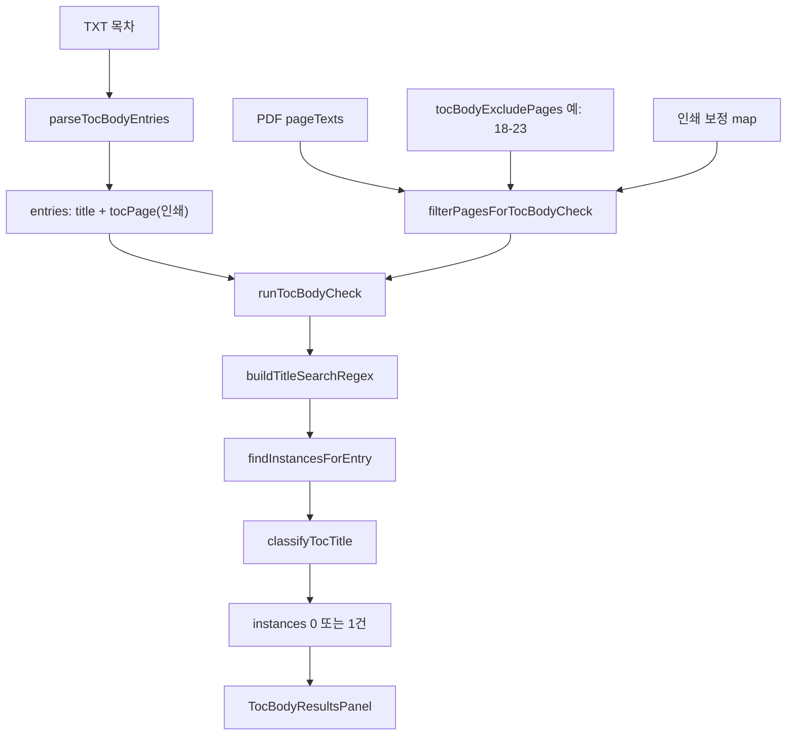

# 목차 · 본문 일치 확인 — 코드 구조 (다른 AI/리뷰용)

작성 목적: `15개 중 7 일치 · 1 불일치 예상 · 7 누락` 등 결과가 나올 때, **어느 단계에서 끊기는지** 코드 기준으로 추적하기 위한 문서.

워크스페이스: `pdf-publish-proofread` (PC worktree)

---

## 1. 한 줄 요약

1. 사용자가 붙여 넣은 **TXT 목차**를 파싱 → `{ title, tocPage }[]` (쪽수는 **인쇄 쪽** 기준 숫자)
2. PDF 전 페이지 텍스트(`pageTexts`)에서 **목차판 제외**·**인쇄 보정** 적용 후 `searchPages` 생성
3. 항목마다 정규식으로 제목 검색 → **최대 1건** (`instances[0]`)
4. `classifyTocTitle` → `match` | `missing` | `mismatch`
5. UI에 일치 / 누락 / 불일치 예상 섹션으로 표시

**7개 누락**이 잘못된 대표 원인:

| 단계 | 증상 |
|------|------|
| 파싱 | TXT 줄이 `┃`/공백/`PART` 규칙과 안 맞아 `tocPage` 없음·제목 잘림·중복 제거 |
| 제외 | `18-23` 인쇄 제외가 본문 페이지까지 적용 (`mapSystemPageToPrint`) |
| 검색 | 인쇄 쪽 필터(`printPageReachesListedPrint`)에 안 걸림 (펼침면·보정) |
| shadowed | `경제는 분위기다`처럼 긴 항목에 포함된 짧은 제목 → 앞쪽 fallback 금지 |
| 분류 | regex는 맞는데 `classifyTocTitle`이 `missing` → `findFirstValidTitleOnPages`가 버림 |

---

## 2. 파일 맵 (읽는 순서)

| 순서 | 경로 | 역할 |
|------|------|------|
| 1 | `src/toc-body/lib/tocBodyCheck.js` | **핵심** — 파싱·검색·분류·`runTocBodyCheck` |
| 2 | `src/toc-body/hooks/useTocBodyCheck.js` | 검수 버튼 → `runTocBodyCheck` 호출 |
| 3 | `src/components/MainScreen.jsx` | `mapPrintPageToSystem` / `mapSystemPageToPrint` 연결 |
| 4 | `src/hooks/usePrintedPageDisplay.js` | 보정 active, `toSystemPage`, `formatPage` |
| 5 | `src/lib/printedPageDisplay.js` | 펼침면·shift·anchor 수식 |
| 6 | `src/toc-body/components/TocBodySetupPanel.jsx` | TXT, 목차 페이지 범위(제외) 입력 |
| 7 | `src/toc-body/components/TocBodyResultsPanel.jsx` | 결과 카드 (항목당 1곳) |
| 8 | `src/toc-body/utils/toc-body-result-entries.js` | 일치→누락→불일치 섹션 |
| 9 | `src/toc-body/lib/tocBodyCheck.test.js` | 단위 테스트 |
| 10 | `src/App.jsx` | `tocBodyText`, `tocBodyExcludePages` 규칙 세트 저장 |

---

## 3. 데이터 흐름



---

## 4. 엔트리: `runTocBodyCheck`

**파일:** `src/toc-body/lib/tocBodyCheck.js`

```javascript
export function runTocBodyCheck(
  pages,              // pdf.pageTexts — { pageNum, text }[]
  tocBodyText,
  bodyStartPage,      // 규칙 세트 (보통 null)
  excludePdfTocPages, // 예: "18-23" 인쇄 쪽
  mapPrintPageToSystem,  // 인쇄 → 파일
  mapSystemPageToPrint,  // 파일 → 인쇄(왼쪽)
) {
  const entries = parseTocBodyEntries(tocBodyText);
  const searchPages = filterPagesForTocBodyCheck(...);

  entries.forEach(({ title, tocPage }, tocLineIndex) => {
    const re = buildTitleSearchRegex(title);
    const systemTocPage = resolveTocEntrySystemPage(tocPage, mapPrintPageToSystem);

    const found = findInstancesForEntry(
      searchPages, re, systemTocPage, title,
      tocPage,              // listedPrintPage (인쇄)
      mapSystemPageToPrint,
      entries,              // shadowed 판단용
    );

    const status = classifyTocTitle(title, found);
    const chosen = status === 'missing' ? null : pickTocInstance(title, found, status);
    const instances = chosen ? [chosen] : [];

    groups.push({ label: title, tocStatus: status, instances, ... });
  });
}
```

---

## 5. TXT 파싱

### 5.1 주요 함수

| 함수 | 설명 |
|------|------|
| `preprocessTocTextLines` | 줄 합치기 (`다!` 등 이어 붙임) |
| `expandTocRawLineEntries` | 한 줄 → 항목 배열 (`┃` 있으면 `expandBarTocLineEntries`) |
| `expandPlainTocLineEntries` | `만들기 26 경제는 29` 내부 분할 (`isLikelyInternalTocSplit`) |
| `parseTocBodyEntries` | 전체 TXT → `{ title, tocPage }[]`, **제목 중복 제거(`seen`)** |

### 5.2 예시

입력:

```text
경제왕국 만들기  28┃경제는 분위기다 30
```

파싱 결과 (테스트 기대값):

```javascript
[
  { title: '경제왕국 만들기', tocPage: 28 },
  { title: '경제는 분위기다', tocPage: 30 },
]
```

### 5.3 로컬 확인

```bash
node -e "import { parseTocBodyEntries } from './src/toc-body/lib/tocBodyCheck.js'; console.log(parseTocBodyEntries(\`실제 TXT\`));"
```

---

## 6. 검색 대상 페이지 (목차판 제외)

**함수:** `filterPagesForTocBodyCheck`, `isSystemPageInTocExcludePrintRange`

- `tocBodyExcludePages`: `"18-23"` → 인쇄 쪽 Set `{18,19,...,23}`
- `mapSystemPageToPrint(파일쪽)` 이 **18 또는 19** (펼침 오른쪽)이면 해당 **파일 페이지는 searchPages에서 제거**
- 보정이 켜져 있을 때만 인쇄 기준 제외 (MainScreen에서 `mapSystemPageToPrint` 전달)

**주의:** 본문이 있는 파일 페이지의 인쇄 라벨이 18–23에 들어가면, 그 페이지는 **검색 자체가 안 됨** → 무조건 `missing`.

---

## 7. 항목당 1건 찾기 (`findInstancesForEntry`)

가장 복잡한 구간. **현재 2단계:**

### 7.1 1차: 인쇄 쪽 (`findInstancesOnPrintPages`)

조건: `listedPrintPage`(목차 줄 끝) != null **且** `mapSystemPageToPrint` 있음.

```javascript
printPageReachesListedPrint(printLeft, listedPrintPage) {
  // 펼침 6–7P + 목차 7쪽: left=6, listed=7 → true
  if (left <= listed && listed <= left + 1) return true;
  return left >= listed;
}
```

- 위 조건을 만족하는 PDF 페이지만 순회
- 페이지당 **첫 매칭 1건** (`findTitleInstances(..., maxCount=1)`)
- `classifyTocTitle !== 'missing'` 인 것만 유효

### 7.2 2차: 파일 쪽 fallback (`findInstancesOnFilePages`)

1차에서 못 찾으면:

1. `systemTocPage` 파일 페이지
2. 그 **뒤** 파일 페이지 (`pageNum > systemTocPage`)
3. (옵션) **앞** 파일 페이지 — `allowBefore = !shadowed`

### 7.3 shadowed (짧은 제목 · 긴 제목 포함)

```javascript
isTitleShadowedByLongerTocEntry(title, entries) {
  return entries.some(
    (e) => e.title !== t && e.title.length > t.length && e.title.includes(t),
  );
}
```

예:

- `PART Ⅰ. 경제는 분위기다` (긴 항목)
- `경제는 분위기다` (짧은 항목) → **shadowed = true**

→ 인쇄 검색 실패 시 **파일 24–25쪽(앞)은 보지 않음** (24–25에서 일치로 잡히는 것 방지).  
→ 인쇄 검색도 실패하면 **누락** (의도: 30쪽 본문만).

**사용자 케이스:**

- `PART Ⅰ. 경제는 분위기다` → 24–25P **불일치 예상** (맞음)
- `경제는 분위기다` → 24–25 **일치** (틀림, **30쪽**이어야 함)

---

## 8. PDF 제목 정규식

**함수:** `buildTitleSearchRegex` → `buildWordPattern` / `buildHangulWordPattern` / `buildLatinTokenPattern`

- 어절 단위 split, 어절 사이 유연 공백·줄바꿈
- 한글 4음절 이상: `경제왕국` ↔ `경제 왕국`
- `PART Ⅰ` ↔ `PART I`, `CHAPTER 1.` 등

---

## 9. 일치 / 누락 / 불일치 분류

**함수:** `classifyTocTitle`

| 상태 | 조건 (요약) |
|------|-------------|
| `match` | 정규화 후 완전 일치, 또는 줄바꿈만 다름 |
| `mismatch` | 띄어쓰기만 다름, 또는 유사도 ≥ 0.9, 또는 후보는 있으나 유사도 낮음 |
| `missing` | 후보 없음 |

**함수:** `findFirstValidTitleOnPages`

- regex 매칭은 됐는데 `classifyTocTitle === 'missing'` 이면 **그 페이지 결과를 버림**
- → “PDF에 있는데 누락” 원인 후보

---

## 10. 인쇄 보정 연결

**MainScreen.jsx:**

```javascript
const mapTocPrintPageToSystem = (printPage) =>
  pageDisplay.active ? pageDisplay.toSystemPage(printPage) : printPage;

const mapTocSystemPageToPrint = (systemPage) =>
  pageDisplay.active ? pageDisplay.formatPage(systemPage) : systemPage;
```

- `formatPage`: 펼침면 문자열 `"24-25"` → `parsed.start` → **24** (왼쪽 인쇄 쪽)
- `toSystemPage`: 인쇄 입력 → 파일 페이지 (펼침·shift·anchor — `printedPageDisplay.js`)

**useTocBodyCheck:** `printedPagesActive` 없으면 검수 자체를 막음 (보정 필수).

---

## 11. UI · 저장

| 항목 | 위치 |
|------|------|
| TXT / 제외 범위 입력 | `TocBodySetupPanel.jsx` |
| 규칙 세트 필드 | `App.jsx` — `tocBodyText`, `tocBodyExcludePages` |
| 결과 | `TocBodyResultsPanel.jsx` — 항목당 `1곳`, `instances[0]` |
| 섹션 순서 | `toc-body-result-entries.js` — 일치 → 누락 → 불일치 예상 |

---

## 12. 단위 테스트

**파일:** `src/toc-body/lib/tocBodyCheck.test.js`

| 테스트 | 내용 |
|--------|------|
| `┃` 분리 | `경제왕국 만들기  28┃경제는 분위기다 30` |
| 인쇄 제외 | `18-23`, 28쪽 본문 유지 |
| 짧은 제목 | 30쪽 이후만, 24–25 PART 블록 무시 |
| 펼침면 | `6–7P`에 목차 `7쪽` |

**한계:** 많은 테스트가 `map(n)=>n` (파일=인쇄) 단순 맵. **실제 보정+펼침면** 환경과 어긋날 수 있음.

---

## 13. 다른 AI에게 줄 재설계 체크리스트

1. **단일 진실:** 목차 줄 끝 숫자 = 인쇄 쪽? 파일 쪽? 검색·제외·UI 표시를 하나로 통일.
2. **검색 단순화:** 인쇄 필터 → 파일 fallback → shadowed 금지 3층이 누락을 만듦. 규칙 재작성 제안.
3. **파싱 검증:** 실제 15줄 TXT로 `parseTocBodyEntries` 덤프, 7 누락 항목별 `title`/`tocPage` 확인.
4. **제외 검증:** 누락 항목 본문 파일쪽의 `formatPage`가 18–23에 포함되는지.
5. **분류 검증:** `regex.test(text)` true인데 `findFirstValidTitleOnPages` empty인지.
6. **shadowed:** `경제는 분위기다`에 대해 `findInstancesOnPrintPages`가 30쪽에서 hit 하는지.

---

## 14. 디버그 시 수집할 정보 (항목 1개당)

```text
- parse 결과: title, tocPage
- systemTocPage = mapPrintPageToSystem(tocPage)
- shadowed: isTitleShadowedByLongerTocEntry
- searchPages 개수 / 제외된 pageNum 목록
- findInstancesOnPrintPages 시도: 각 pageNum → printLeft
- 최종 found: pageNum, matchedText
- classifyTocTitle 결과
```

---

## 15. 관련 대화·이슈 요약

- 목차 페이지 범위: **인쇄 쪽** `18-23`만 PDF 검색 제외 (앞쪽 7·11·15쪽 본문은 검색)
- `경제는 분위기다 30`: 24–25 PART 블록이 아닌 **30쪽 본문**에 매칭되어야 함
- 항목당 **일치/누락/불일치 예상 각 1건**만 (`instances.length` 0 또는 1)

---

*이 문서는 코드 리뷰·외부 AI 협업용이며, 배포 `docs/` 와는 별도입니다.*
