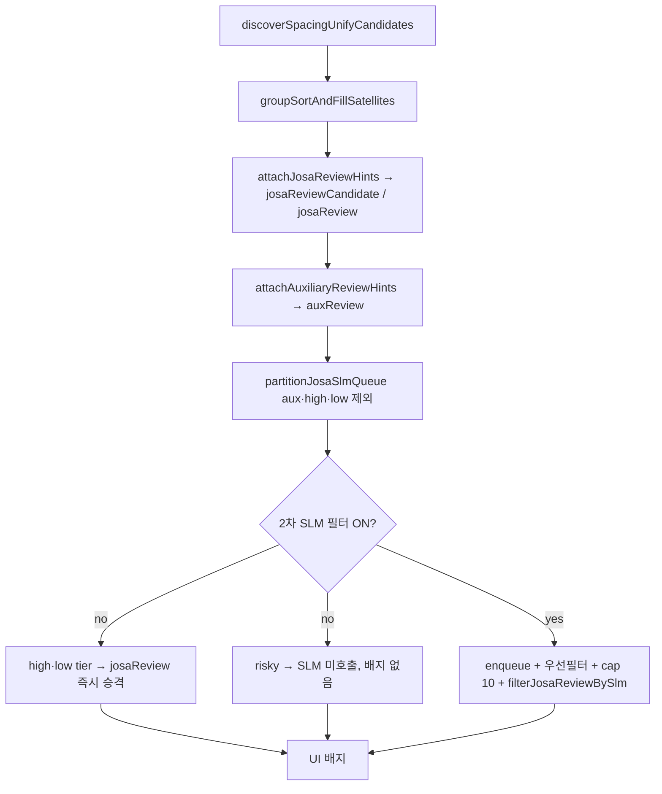

# 조사·어간 검토 — SLM 2차 필터 구현 스케치

**상위 문서:** `unify-candidate-spacing-redesign-2026-07-29.md` §11.5  
**관련:** 용언 2차 검토(목록 삭제) — `unify-predicate-review-slm-design-2026-07-30.md`  
**상태:** 구현 중 (단계 0–4 + §3.2·3c POC 완료) — **현행: 로컬에서만 SLM 시험** (`VITE_UNIFY_JOSA_SLM` 기본 off). 클라우드·서버리스 GPU **보류**.  
**작성:** 2026-07-30

---

## 0. 용어 — 이 문서에서 쓰는 말 (헷갈리지 않게)

| 말 | 의미 | 우리 예 | **이렇게 부르지 않기** |
|----|------|---------|------------------------|
| **SLM** | 실제로 판별하는 **경량 언어 모델** (가중치·instruct) | `kakaocorp/kanana-2-1.3b-instruct` | vLLM, ChatGPT |
| **추론 서버** | SLM 가중치를 GPU/CPU에서 **실행해 주는 프로그램** | vLLM, Hugging Face `transformers`, SGLang | SLM, LLM |
| **외부 클라우드 LLM API** | 원고를 통째로 보내는 **대형 상용 API** (우리는 안 씀) | OpenAI ChatGPT API 등 | 우리 2차 필터 |
| **2차 필터** | 규칙 뒤 SLM이 배지 여부만 확정하는 **기능 단계** | `filterJosaReviewBySlm` | — |

**vLLM 주의:** 이름에 `LLM`이 들어가지만 **추론 서버 제품명**이다. 모델이 대형 LLM이라는 뜻이 아니다. 문장 패턴은 항상 **「vLLM으로 카나나 SLM을 돌린다」**처럼 쓴다.

**코드·플래그:** `VITE_UNIFY_JOSA_SLM`, `unifyJosaReviewSlm/` — 기능 이름이 SLM인 것은 맞다(모델이 SLM이므로). UI 문구에는 SLM·vLLM·LLM을 넣지 않고 **「조사·어간 2차 검토」**만 쓴다.

---

## 1. 문제

규칙만으로 `이`/`가`/`하`/`적` 접미를 떼면:

- **오탐:** `가치평가`(4음절+`가`), `활동이며`(`이` 가드)
- **누락:** 접미 목록을 계속 수동 추가(`이며`, `하도록`, `적이고`…)

→ **규칙은 후보를 넓게, 2차 SLM은 배지 여부만 확정**하는 2단이 맞다.  
판별 모델은 **SLM**(카나나-2 instruct, ~1.3B). ChatGPT급 **외부 클라우드 LLM API**가 아니다. 짧은 3분류·JSON 출력에 충분하다.

---

## 2. 파이프라인 (현재 + SLM)



**실행 순서 (확정):**

1. `attachJosaReviewHints` — 조사·어간 1차 (tier 부여)
2. `attachAuxiliaryReviewHints` — bon-bojo stem (현행과 동일, **josa 필드를 지우지 않음**)
3. `partitionJosaSlmQueue` — SLM 큐 구성 시 **`auxReview` 있는 클러스터는 josa SLM에서 제외** (UI만 보조용언 배지, SLM 배치 낭비 방지)
4. `tier: 'high'` / `tier: 'low'` — SLM **미호출**, `josaReview` 즉시 승격 (§10.3). 플래그 OFF여도 동일.
5. `tier: 'risky'` — 플래그 ON일 때만 `filterJosaReviewBySlm` (상한 50). 플래그 OFF면 배지 없음.
6. UI — `auxReview` 있으면 조사 배지 숨김 (표시만; 데이터는 유지 가능)

**현행 코드 참고:** `unifyCandidateGrouping.js`는 `attachAuxiliaryReviewHints(attachJosaReviewHints(...))` 순. SLM 단계는 이 **둘 다 끝난 뒤** enqueue한다.

**우선순위 (UI, 기존 합의):**

- `auxReview` 있으면 → 「보조용언 추정, 검토 필요」만
- 없고 `josaReview.status === 'review'` → 「조사 · 어간 추정, 검토 필요」

---

## 3. 데이터 모델 확장

### 3.1 `UnifySpacingCluster` (discover typedef)

```ts
// 1차 규칙만 채움 — SLM 전
josaReviewCandidate?: {
  stemKey: string
  stemSpaced: string
  suffix: string
  tier: 'high' | 'low' | 'risky'   // risky = SLM 필수
  peerKeys: string[]
}

// SLM 통과 후 UI용 (지금의 josaReview와 동일 역할)
josaReview?: {
  stemKey: string
  peerKeys: string[]
  status: 'review'
  // josaReview에 올라온 시점 = 승격 확정. SLM 경로면 confidence는 항상 'high'.
  slm?: { model: string; confidence: 'high' }
}
```

**마이그레이션:** 당분간 `attachJosaReviewHints`가 바로 `josaReview`를 채우는 현행 유지.  
SLM 도입 시 1차는 `josaReviewCandidate`만 채우고, 2차가 `josaReview`를 채우도록 분리.

SLM 원본 응답의 `medium`/`low`는 `JosaSlmReviewResult`에만 존재하며, 승격 실패 시 `josaReview`를 채우지 않는다. 관대 모드(§12)는 별 플래그·필드로 검토.

### 3.2 SLM 요청 1건

```ts
type JosaSlmReviewItem = {
  id: string              // cluster.key
  variant: string         // 대표 띄움 variant 우선
  gluedVariant: string
  ruleStem: string
  ruleSuffix: string
  contextBefore: string   // 매칭 구간 **앞쪽** 최대 40자 (별도 필드)
  contextAfter: string    // 매칭 구간 **뒤쪽** 최대 40자 (별도 필드)
}
```

맥락은 `occurrencesByVariant` + **같은 줄**(표기 통일 스캔과 동일)에서 슬라이스. 전 문장·전 원고는 보내지 않음.

#### 맥락 40자 규칙 (확정)

| 항목 | 규칙 |
|------|------|
| 길이 | **앞 40자 + 뒤 40자** (합 40이 아님). 각각 UTF-16 코드 유닛이 아니라 **문자(grapheme) 수** 기준 |
| 범위 | variant가 나온 **한 줄** 안에서만. 줄 넘어가지 않음 |
| 자르기 | 예산 안에서 **문장 부호**(`。.!?…`, `,;`) 경계로 맞추려 시도. 없으면 하드 truncate |
| 중심 | `matchedText` / variant가 줄 안에서 차지한 **구간 양쪽**에서 잘라냄 (줄 시작·끝이면 한쪽만 짧음) |
| 최소 | 가능하면 **매칭 어절 1개 + 이웃 어절**이 앞 또는 뒤에 포함되도록 (예산 내) |

한국어 조사·어간 판별에 **어절 단위 맥락**이 필요하므로, 순수 40자 고정보다 **줄 내 부호 경계 우선**이 맞다.

### 3.3 SLM 응답 1건 (JSON only)

```json
{
  "id": "활동이며",
  "isBoundary": true,
  "kind": "josa_or_suffix",
  "confidence": "high",
  "reason": "활동+이며 연결 어미"
}
```

#### `kind` enum (확정)

| 값 | 의미 | 배지 |
|----|------|------|
| `josa_or_suffix` | 띄움 위치가 조사·어미·접미 경계 | `isBoundary`+confidence 조건 충족 시 |
| `compound_word` | 합성어·고유명·어간 일부 (`가치평가`의 `가` 등) | **없음** |
| `uncertain` | 판별 불가 | **없음** (실패와 동일) |

#### `confidence` enum (확정)

| 값 | 배지 (기본 정책) |
|----|------------------|
| `high` | 표시 가능 |
| `medium` | **숨김** (누락 우선; 베타 후 플래그로 완화 검토) |
| `low` | **숨김** |
| 누락·파싱 실패 | **숨김** |

#### 배지 승격 조건 (확정, 11.5.3과 일치)

`josaReview` 배지를 붙이려면 **모두** 만족:

1. `cluster.auxReview` 없음 (UI는 보조용언만)
2. SLM 미사용 경로: `tier === 'high'` (§12)
3. SLM 경로: `isBoundary === true` **且** `kind === 'josa_or_suffix'` **且** `confidence === 'high'`

`medium`은 11.5.3 「실패 시 배지 숨김」과 같은 원칙으로 **기본 숨김**.

#### 배지 없음 — 세 가지를 UI에서 구분 (§6.3, 2026-07-30 확정)

| 상태 | 의미 | 사용자가 보는 것 |
|------|------|------------------|
| **검토 대기** | tier `risky`, SLM **아직 미시도** (버튼 안 누름) | 「2차 검토 가능」 등 — **확정 아님** |
| **검토 완료·해당 없음** | SLM 시도 후 `compound_word` / `uncertain` / `medium`·`low` / 파싱 실패 | 배지 없음 = **「조사 경계 아님으로 확정」에 가깝게** |
| **검토 완료·승격** | SLM `high` + `josa_or_suffix` | 「조사·어간 2차 검토」 배지 |

「배지 없음」만으로는 2·3을 구분할 수 없으므로, **1(대기)** 은 반드시 별도 표시.

---

## 4. 모듈 배치 (신규)

```
src/lib/unifyJosaReview.js          # 1차 규칙 (기존)
src/lib/unifyJosaReviewSlm/
  index.js                          # filterJosaReviewBySlm(clusters, opts)
  enqueue.js                        # cluster → JosaSlmReviewItem[], tier 분류
  prompt.js                         # instruct 프롬프트·few-shot
  parse.js                          # JSON 추출·검증 (zod 또는 수동)
  runner/
    noopRunner.js                   # SLM off 시 no-op
    kananaRunner.js                 # (보류) 브라우저에서 SLM 직접 — ONNX 미지원
    serverRunner.js                 # HTTP → 추론 서버(vLLM 등) → SLM
src/lib/unifyJosaReviewSlm.test.js  # parse·enqueue·golden mock
```

**의존성:** SLM 러너는 **dynamic import** — 플래그 off면 번들에 안 실림.

---

## 5. 큐(enqueue) 규칙

`enqueueJosaSlmReview(cluster)` → `null` | `JosaSlmReviewItem`

**`partitionJosaSlmQueue`에서 먼저 제외 (SLM 호출 0회):**

| 조건 | 이유 |
|------|------|
| `auxReview` 있음 | 본보조 배지만. josa SLM 큐·10건 한도에 **넣지 않음** |
| `tier === 'high'` | 규칙 확신 — SLM 생략, `josaReview` 즉시 (§12) |
| `tier === 'low'` | 저위험 조사 peer만 — SLM 생략, 정책에 따라 배지 유지 |
| bon-bojo stem만 해당 | aux 단계에서 처리됨 |
| `tier === 'risky'`이지만 우선 아님 | SLM **생략** — 규칙이 준 `josaReview` **유지** |

**SLM 큐에 넣는 조건 (`tier === 'risky'` + 우선 필터):**

| 조건 (OR) | 비고 |
|-----------|------|
| `stemMismatch === true` | 띄움·붙임 `stemKey` 불일치 |
| `suffix` ∈ `가` / `이` | 조사 vs 합성어 오탐이 큰 접미 (`JOSA_SLM_PRIORITY_SUFFIXES`) |

그 외 risky(예: `은`/`는` 규칙 배지만)는 큐에 넣지 않는다.

### 5.1 배치 상한 10건 — 초과 시 (확정, 코드 반영)

상수: `JOSA_SLM_BATCH_CAP = 10` (`enqueue.js`)

**정렬 키 (동일 입력이면 항상 동일 결과):**

1. 우선 필터 통과분만 풀에 진입
2. `totalCount` **내림차순** (문서에서 더 자주 나온 후보 우선)
3. `cluster.key` **가나다순** (`localeCompare('ko')`) — 동점 tie-break

**초과분 (`riskyDropped`):** SLM **미호출** → `josaReview` **제거** (배지 없음).

**재현성:** 찾기 1회당 `documentFingerprint` + 정렬 키로 큐 순서 고정. 같은 PDF·같은 discover 결과면 잘리는 항목 집합 동일.

### 5.2 SLM 결과 캐시 (§6 C안, 확정 초안)

**키:** `(documentFingerprint, cluster.key)`  
**값:** `JosaSlmReviewResult` + 승격 여부(`josaReview` 스냅샷)

| 규칙 | 내용 |
|------|------|
| 저장 시점 | SLM 호출 **성공·실패 모두** (재시도 낭비 방지) |
| 무효화 | `documentFingerprint` 변경(원고 텍스트·페이지 추출 바뀜) |
| 저장소 | 베타: `sessionStorage` 또는 프로젝트 세션 blob; 상용: Firestore 사용자별 (TTL 선택) |
| 효과 | 같은 원고 재오픈·재클릭 시 **이미 검토한 cluster.key는 GPU 재호출 안 함** |

§5.1 큐 정렬과 동일하게 fingerprint를 쓰면, 캐시 hit 시 서버리스 비용·콜드스타트가 한 번 더 줄어든다.

**UI (선택):** 잘린 건수가 있으면 패널 하단에 「조사·어간 2차 검토 N건은 한도로 생략됨」1줄 (베타 4단계).

---

## 6. 호출 시점

> **2026-07-30 방향:** 제품(베타)은 **SLM 기본 off**. 카나나는 **로컬 시험만**.  
> §6 **C안·서버리스**는 장기 설계로 남겨 두고, **당장 채택하지 않음**. A안 코드는 플래그 ON일 때만 POC로 동작.

### 6.0 안 요약

| 안 | 트리거 | SLM 시점 | 비고 |
|----|--------|----------|------|
| **로컬 POC (현행 코드)** | 찾기 직후 자동 (플래그 ON) | 동기 | `kanana-openai-server` / mock. **기본 OFF** |
| ~~**A**~~ 배포 자동 | 찾기 완료 직후 | 동기 | 채택 안 함 |
| ~~**B**~~ | 백그라운드 자동 | 비동기 | 채택 안 함 |
| **C (장기 옵션)** | 「2차 검토」 버튼 | 비동기 | 서버리스 검토 시 재개 |

### 6.0.1 현행 방침 — 로컬에서만 써 보기 (확정, 2026-07-30)

**클라우드 GPU·서버리스·유료 추론 API는 당분간 쓰지 않는다.**  
카나나 SLM은 **개발자 PC에서만** 품질·프롬프트·골든셋을 확인하는 용도.

| 레이어 | 내용 |
|--------|------|
| **베타·배포** | `VITE_UNIFY_JOSA_SLM` **기본 off** — 사용자는 규칙만 (보조용언·조사 tier·용언 정렬 포함) |
| **로컬 시험** | `VITE_UNIFY_JOSA_SLM=true` + `scripts/kanana-openai-server.py` 또는 vLLM (§13) |
| **비용** | 클라우드 청구 **0**. 전기·PC 시간만. CPU면 건당 ~십수 초 → **1건·소수 샘플**만 |
| **실사용 큐 (코드)** | risky 중 stemMismatch·`가`/`이` 우선 + **cap 10** (§5·`enqueue.js`) |
| **§6 C안·서버리스·쿼터** | **설계 보류** (§6.2~6.4). 로컬 검증 후 재검토 |

§6.2~6.4·서버리스 쿼터 문구는 **향후 옵션**으로 남겨 둔다. 지금 구현·운영 우선순위는 **로컬 OFF가 기본**.

---

### 6.1 C안 — 명시적 버튼 + 비동기 (향후 옵션, 미채택)

**흐름:**

1. **표기 통일 찾기** → 규칙 1차 + tier `high`/`low` 배지 **즉시** (SLM 0회)
2. tier `risky` 카드 → 배지 없음 + **「2차 검토 가능」** (§3.3 표 — 검토 대기)
3. 사용자가 **「조사·어간 2차 검토」**(또는 패널 일괄 버튼) 클릭
4. 앱 → `POST /api/unify/josa-slm` (또는 serverless runner) → **한 번의 인퍼런스 세션**에서 큐 처리
5. 완료된 카드만 배지 갱신 또는 「해당 없음」확정 표시

```js
// 목표 UX (의사코드) — 찾기 직후 SLM 호출 없음
const grouped = groupSortAndFillSatellites(clusters, raw);
// risky 카드에 slmReviewStatus: 'pending' | 'running' | 'done' | 'cached'

async function onJosaSlmReviewClick(selectedClusterKeys) {
  const queue = buildQueueFromSelection(selectedClusterKeys, { cap: JOSA_SLM_BATCH_CAP });
  const cached = loadSlmCache(documentFingerprint);
  const toRun = queue.filter((k) => !cached.has(k));
  await runJosaSlmReviewBatched(toRun, { pageTexts, onProgress });
  mergeResultsIntoGroups(grouped, { ...cached, ...results });
}
```

- 로딩: 패널·카드 단위 **「2차 검토 중… (3/12)」** — 찾기 전체를 막지 않음
- 실패·미확신: §3.3대로 배지 숨김 + **검토 완료·해당 없음** 상태로 전환 (§6.3)

### 6.2 서버리스 GPU — 호출·배치 단위 (확정)

**서버리스는 idle 시 0원일 뿐, 콜드스타트·추론 시간을 없애지 않는다.**  
그래서 **「버튼 1회 = 서버리스 HTTP 1회 = 모델 로드 1회」** 안에서만 내부 배치를 돈다.

| 개념 | 정의 |
|------|------|
| **외부 호출 1회** | Modal/RunPod 등 **엔드포인트 1 POST** — 워커 기동·모델 로드 **최대 1번** |
| **내부 배치** | 그 세션 안에서 요청 `items[]`를 **5~10건씩 순차** `generate` (VRAM·타임아웃) |
| **금지** | risky 50건 → **50회** serverless POST (콜드스타트 반복) |

```
버튼 1회 클릭
  → POST /api/unify/josa-slm  { items: [ ...최대 cap건, 캐시 제외... ] }
  → GPU 워커: load model once
  → for chunk of items (5~10): infer sequential
  → return { results: [...] }
```

현재 `serverRunner.reviewBatch`는 **건당 HTTP 1회** — 서버리스 C안 구현 시 **배치 API 1회**로 바꾸거나, 서버 측에서 단일 요청 multi-item을 받도록 확장.

**인프라 후보:** Modal, RunPod Serverless, HF Inference Endpoints (scale-to-zero) — 스타트업 크레딧·카나나 라이선스(§7.2) 병행 검토.

### 6.3 UX — 검토 대기 vs 검토 완료 (확정)

§3.3 「배지 숨김」은 **SLM을 시도한 뒤** 확신이 낮을 때다. C안에서는 **미시도**가 추가된다.

| `slmReviewStatus` (제안 필드) | UI |
|-------------------------------|-----|
| `pending` | 「2차 검토 가능」·버튼 활성 |
| `running` | 「2차 검토 중…」 |
| `promoted` | 「조사·어간 2차 검토」 배지 |
| `rejected` | 배지 없음 + 「검토 완료」(조사 경계 아님) — 툴팁으로 구분 |
| `cached` | `rejected` 또는 `promoted`와 동일 표시, 서버 스킵 |

### 6.4 서버 쿼터 — 예산 안전판 (확정, 2026-07-30)

버튼만으로는 **한도가 없다.** 베타·상용은 **서버 측 하드 쿼터**(Firestore 등).  
표기 통일 **찾기** 검수권과 **완전 분리** — SLM 전용 카운터.

#### 「1회」의 정의

| 1회 | ≠ cluster 1건 |
|-----|----------------|
| **1회** | 사용자가 **「2차 검토」버튼 1번** → `POST /api/unify/josa-slm` **1번**(모델 로드 1번, 내부 최대 cap건 처리) |
| 카운트 안 함 | §5.2 **캐시 hit** — 이미 `(documentFingerprint, cluster.key)` 검토 완료 |

#### 한도 (KST 일 단위, `YYYY-MM-DD`)

| 구분 | 2차 검토 **1일 횟수** |
|------|------------------------|
| **로컬 개발** | **제한 없음** (`localhost` / `127.0.0.1` 또는 `VITE_BETA_QUOTA_RELAX_LOCAL=true` — 기존 검수 한도와 동일 패턴) |
| **무료(베타) 사용자** | **1회/일/인** |
| **유료 회원** (`plan: paid`) | **5회/일/인** |
| **전역(모든 사용자 합)** | **100회/일** — 도달 시 **당일 전원 SLM 비활성** |

우선순위: **전역 100** 먼저 검사 → 개인 한도. 둘 다 서버에서 판정(클라이언트만으로는 우회 가능).

#### 초과·전역 소진 시 동작

| 상황 | 동작 |
|------|------|
| 개인 한도 초과 | 「2차 검토」버튼 비활성 + 「오늘 2차 검토 한도(N회)에 도달」 |
| 전역 100 도달 | **모든 사용자** SLM 버튼 비활성 + 「오늘 2차 검토 서비스가 마감되었습니다」 |
| SLM 불가 | **규칙 1차·표기 통일 찾기·tier high/low 배지는 그대로** |
| tier `risky` | `slmReviewStatus: pending` 유지 또는 「오늘은 2차 검토 불가」 — **조사 경계 아님으로 확정하지 않음** (§6.3) |

API: 한도 초과 시 **429** + `{ code: 'josa_slm_quota_user' | 'josa_slm_quota_global' }`.

#### 구현 메모 (미구현)

```
Firestore (예시)
  josaSlmQuota/global/days/{date}     → count (전역, max 100)
  josaSlmQuota/users/{uid}/days/{date} → count (개인, max 1 또는 5)
```

상수(제안):

```js
export const JOSA_SLM_QUOTA_GLOBAL_DAILY = 100;
export const JOSA_SLM_QUOTA_USER_DAILY_FREE = 1;
export const JOSA_SLM_QUOTA_USER_DAILY_PAID = 5;
```

어드민·내부 테스터 면제는 `betaDailyQuota`의 `BETA_QUOTA_ADMIN_*`와 동일 패턴으로 **SLM 카운터만** 스킵 가능(선택).

### 6.A (구현됨, POC 전용) — 찾기 직후 자동 호출

로컬·플래그 ON 시 `UnifyCandidateFindPanel` 찾기 완료 직후 `filterJosaReviewBySlm` 동기 호출.  
**CPU에서 체감 불가** — 베타 기본 `VITE_UNIFY_JOSA_SLM=false`. C안 구현 후 이 경로 제거 또는 dev-only.

```js
// 현재 코드 (POC) — §6 C안으로 대체 예정
if (isUnifyJosaSlmReviewEnabled()) {
  const slmResult = await runJosaSlmReviewOnClusterGroups(baseGrouped, { pageTexts });
}
```

---

## 7. SLM 모델 + 추론 서버 (역할 분리)

§0 용어표 참고. **SLM = 카나나 가중치**, **추론 서버 = vLLM/transformers 등 실행기**.

### 7.1 브라우저 (장기, WebGPU)

- 패키지: `@huggingface/transformers` (ONNX runtime Web)
- **SLM:** `kakaocorp/kanana-2-1.3b-instruct` (또는 3B)
- 브라우저 안에서 SLM을 직접 돌림 (별도 vLLM 없음)
- 최초 1회 모델 다운로드 → IndexedDB 캐시
- 배치: 5~10건씩 sequential (VRAM)

### 7.2 인디야 서버 (C안 — 서버리스 GPU)

- **추론:** scale-to-zero GPU (Modal / RunPod Serverless / HF Endpoints 등)
- **SLM:** `kanana-2-1.3b-instruct` — 워커 1회 기동당 **모델 1회 로드** (§6.2)
- 앱 → `POST /api/unify/josa-slm` → **단일 요청에 `items[]` 배치** → GPU → SLM
- snippet만 전송. 외부 범용 LLM API로 원고 통째 전송 안 함.
- **쿼터:** §6.4 — 무료 1/일·유료 5/일·전역 100/일·로컬 무제한
- **캐시:** §5.2 `(documentFingerprint, cluster.key)`
- 로컬 POC: `kanana-openai-server.py` / vLLM — **개발·골든셋만**, 베타 사용자 경로 아님

**카나나 라이선스:** 사용자 snippet을 우리 서버에서 추론 = SaaS 가능성 → 상용 전 `unify-josa-review-slm-kanana-recon-2a.md` §5 검토.

### 7.3 프롬프트 골격 (SLM에 넣는 지시)

```
당신은 한국어 교정 보조입니다. 띄어쓰기 이형태에서 "규칙이 제안한 접미"가
조사·어미 경계인지, 합성어/고유명 일부인지 판별하세요.
교정안을 쓰지 말고 JSON만 출력하세요.

예시:
입력: variant="가치평가", ruleSuffix="가", context="…"
출력: {"isBoundary":false,"kind":"compound_word","confidence":"high"}

입력: variant="활동 이며", ruleStem="활동", ruleSuffix="이며", context="…"
출력: {"isBoundary":true,"kind":"josa_or_suffix","confidence":"high"}
```

골든셋: `unifyJosaReviewSlm.golden.json` — `unifyJosaReviewSlm.golden.test.js`에서 parse 10건·pipeline 10건 회귀.

---

## 8. feature flag

```js
// featureFlags.js
export function isUnifyJosaSlmReviewEnabled() {
  return import.meta.env.VITE_UNIFY_JOSA_SLM === 'true';
}
```

베타 freeze: `ruleEngine` 본체는 안 건드림. **표기 통일 추천 레이어**만 추가.

---

## 9. 구현 단계

| 단계 | 내용 | 산출 |
|------|------|------|
| **0** | `josaReviewCandidate` 분리, `partitionJosaSlmQueue`·tier | **완료** — `unifyJosaReviewSlm/enqueue.js`, `unifyJosaReviewSlm.test.js` |
| **1** | `noopRunner` + `filterJosaReviewBySlm` 골격, 플래그 off | **완료** — `filter.js`, `parse.js`, `runner/noopRunner.js` |
| **2a** | 카나나-2 정찰 (모델·배포·라이선스·브라우저 가능성) | **완료** — `unify-josa-review-slm-kanana-recon-2a.md`, `scripts/kanana-recon-sample.py` |
| **2b** | 골든셋 20건 + `noopRunner` CI | **완료** — `unifyJosaReviewSlm.golden.json`, `unifyJosaReviewSlm.golden.test.js` |
| **3** | `serverRunner` POC — 추론 서버(vLLM/transformers) + SLM | **골격 완료** — `prompt.js`, `runner/serverRunner.js` |
| **3b** | §3.2 맥락 40자 — `contextBefore`/`contextAfter` | **완료** — `context.js`, `filter`·패널 `pageTexts` 연동 |
| **3c** | dev Vite 프록시 — CORS 회피 | **완료** — `/api/josa-slm` → `:8000`, `resolveEndpoint.js` |
| **4** | Panel 연동 + 로딩 UX | **POC 완료** (플래그 ON 시 A안 동기). **기본 OFF** |
| **5** | §6 C안 — 버튼·비동기·서버리스 | **보류** — 로컬 검증 충분할 때까지 |
| **5b** | 쿼터·캐시·배치 API | **보류** |
| **6** | (선택) 상용·`kananaRunner` | ONNX·라이선스·비용 재검토 후 |

**로컬 E2E:** 추론 서버 + 앱 플래그 — **§13** 체크리스트.

---

## 10. 규칙 쪽 정리 (SLM 들어가면)

### 10.1 신규 접미 수동 추가

- 베타 임시로 넣은 `이며`/`하도록`/`적이고`/`해` 등 **더 이상 목록만 늘리지 않음**
- 애매한 신규 패턴 → `tier: 'risky'` → SLM

### 10.2 tier `high` — SLM 우회·배지 유지 (확정)

검증된 접미는 **`UNIFY_JOSA_HIGH_CONFIDENCE_SUFFIXES`** 로 승격. SLM 큐에 넣지 않고 **규칙만으로 `josaReview` 배지**.

| 접미 (초기 목록) | 승격 이유 |
|------------------|-----------|
| `이며` | `이` 4음절 가드 우회, 골든셋 확정 후 |
| `하도록` | `하` 계열, 활용형 경계 |
| `적이고` | `적` + 연결 어미 |
| `에서`, `으로`, … | 기존 `UNIFY_LOW_RISK_JOSA` 전부 → tier `low` 또는 `high` (저위험은 `low`로 SLM 생략·배지 유지) |

**혼란 방지 (상수·tier):**

- `UNIFY_AMBIGUOUS_JOSA_SUFFIXES` — 애매한 접미 → tier **`risky`** → SLM 후보.
- `UNIFY_JOSA_HIGH_CONFIDENCE_SUFFIXES` — 규칙 확신 접미 → tier **`high`** → SLM 생략.
- tier `high` 항목은 스케치·코드 주석에 「SLM 미대상, 규칙 배지」라고 명시. SLM 골든셋 CSV에도 `skipReason: 'tier-high'` 열로 제외.

### 10.3 SLM ON일 때 배지 정책

| tier | SLM | 배지 |
|------|-----|------|
| high | 안 탐 | 규칙 즉시 |
| low | 안 탐 | 규칙 즉시 (저위험 조사 peer) |
| risky | 탐 | `confidence: high` 만 |
| risky + cap 초과 | 안 탐 | **없음** |

- **유지:** bon-bojo stem → `auxReview`, 4음절 `가`/`이` 가드
- **단일 클러스터:** high/risky+SLM 통과 시 배지 (peer 불필요)

---

## 11. 확정 사항 (2026-07-30 리뷰 반영)

1. aux 겹침 → **SLM enqueue 전** 제외 (§2·§5)
2. 우선 필터 + cap 10 초과 → `totalCount` ↓, `key` 가나다 tie-break (§5.1)
3. 맥락 → **앞 40 + 뒤 40자**, 같은 줄, 부호 경계 우선 (§3.2)
4. 배지 → `kind === josa_or_suffix` && `confidence === high` only (§3.3)
5. `이며`/`하도록` 등 → **tier high 승격**, SLM 제외·배지 유지 (§10.2)
6. **현행 운영 → 로컬 SLM만** (클라우드 GPU·서버리스 **보류**). 베타 기본 플래그 **off** (§6.0.1)
7. **장기 옵션:** §6 C안 + 서버리스 (§6.2) — 채택 전제: 로컬에서 품질·큐 필터 검증 후
8. **쿼터·캐시 설계** (§6.4·§5.2) — 서버리스 재개 시 적용. 지금은 미구현
9. **UX 구분** (대기 vs 완료) — C안 재개 시 (§3.3·§6.3)
10. **실사용 후보 축소(코드):** risky 중 stemMismatch·`가`/`이` 우선, `JOSA_SLM_BATCH_CAP = 10`

## 12. 열린 질문

1. SLM 실패 시 — **배지 숨김** 확정 (`medium`·`low` confidence도 동일). 관대 모드는 별 플래그·필드만 검토 (`josaReview.slm`에 `medium` 보존하지 않음).
2. ~~`medium` confidence~~ → 기본 숨김 (§3.3)
3. 카나나-2 1.3B vs 3B — **2a 정찰: 1.3B 우선** (골든셋 오탐 시 3B 재시험)
4. 브라우저 WebGPU — **2a: 보류** (SLM ONNX/GGUF 없음)
5. ~~표기 통일 찾기와 SLM 1회 묶음~~ → 장기 C안 시 분리; **지금은 로컬 플래그만**
6. ~~서버리스 벤더~~ → **보류**. 로컬 `kanana-openai-server.py` / vLLM만 사용

---

## 13. 로컬 수동 검증 가이드

**목적:** tier `risky` 클러스터가 **추론 서버 + SLM**을 거쳐 「조사·어간 2차 검토」 배지가 붙는지, §3.2 **맥락 40자**가 프롬프트에 들어가는지, 실패 시 **배지 숨김**(fail-closed)이 맞는지 확인한다.

**관련:** 모델·라이선스·vLLM 옵션 상세는 `unify-josa-review-slm-kanana-recon-2a.md` §3·§5.

### 13.1 사전 요구

| 항목 | 권장 |
|------|------|
| 워크트리 | `C:\Users\gikan\Documents\pdf-publish-proofread` (`:5173`) |
| GPU | NVIDIA + CUDA (없으면 CPU — 매우 느림) |
| Python | 3.10–3.12 별도 venv (시스템 Python 3.14는 torch 미지원일 수 있음) |
| 추론 서버 | vLLM 또는 `transformers` 직접 (`scripts/kanana-recon-sample.py`) |
| SLM | `kakaocorp/kanana-2-1.3b-instruct` (최초 ~2.6GB+ 다운로드) |

### 13.2 경로 A — vLLM + 앱 E2E (권장)

#### (1) 추론 서버 기동 — **별도 터미널, 켜 둔 채 유지**

```bash
# venv 활성화 후 (pip install vllm — CUDA 환경에 맞는 wheel)
vllm serve kakaocorp/kanana-2-1.3b-instruct ^
  --trust-remote-code ^
  --max-model-len 4096 ^
  --host 127.0.0.1 ^
  --port 8000
```

PowerShell·cmd에서는 `^` 줄바꿈. 한 줄로 써도 된다.

기동 확인:

```bash
curl http://127.0.0.1:8000/v1/models
```

#### (2) 앱 환경 변수 — `.env.local` (git 미추적, 직접 작성)

```env
VITE_UNIFY_JOSA_SLM=true
```

`VITE_UNIFY_JOSA_SLM_ENDPOINT`를 **비우면** dev에서 자동으로 **`/api/josa-slm/v1`** (Vite 프록시 → `127.0.0.1:8000`)를 쓴다. CORS 없이 E2E 가능.

직접 vLLM에 붙이려면 (CORS 설정 필요할 수 있음):

```env
VITE_UNIFY_JOSA_SLM=true
VITE_UNIFY_JOSA_SLM_ENDPOINT=http://127.0.0.1:8000/v1
```

vLLM 포트가 8000이 아니면 `vite.config.js` 프록시 대상을 바꾼다 (서버 전용, Vite 재시작):

```env
JOSA_SLM_PROXY_TARGET=http://127.0.0.1:9000
```

`.env.local` 변경 후 **Vite 전체 재시작** (`npm run dev`). 열어 둔 브라우저가 잠깐 끊길 수 있다.

#### (3) 앱에서 동작 확인

1. `npm run dev` → `http://127.0.0.1:5173`
2. 띄어쓰기 이형태가 있는 PDF 열기
3. **일관성** 탭 → **표기 통일 찾기** 실행
4. 「조사·어간 2차 검토 중…」 로딩 후 카드 배지 확인

**기대 동작**

| tier | SLM 호출 | 배지 |
|------|----------|------|
| `high` / `low` | 없음 | 규칙 즉시 |
| `risky` + SLM `high` 승격 | 있음 | 「조사·어간 2차 검토」 |
| `risky` + 거절·`medium`·파싱 실패 | 있음 | **없음** |
| `risky` + cap(50) 초과 | 없음 | **없음** + 패널 1줄 안내 |

#### (4) DevTools로 요청 확인

- **Network** → `chat/completions` POST — URL이 **`/api/josa-slm/v1/...`** (프록시 기본) 또는 직접 `:8000`
- `messages[1].content`에 `contextBefore="…"` `contextAfter="…"` 포함 여부 (§3.2)
- `temperature: 0`, `max_tokens: 128`

**CORS:** dev 기본 프록시(`/api/josa-slm`)를 쓰면 **같은 origin**이라 CORS 문제 없음. `ENDPOINT`를 `:8000` 직접 URL로 두면 브라우저 CORS에 막힐 수 있음 → §13.3 curl 또는 vLLM `--allowed-origins` 참고.

추론 서버가 꺼져 있거나 타임아웃(15s)이면 **배지 없음**이 정상(fail-closed).

### 13.3 경로 B — curl로 SLM 단독 (추론 서버만 검증)

앱 없이 OpenAI 호환 API·JSON 형식만 확인할 때.

```bash
curl http://127.0.0.1:8000/v1/chat/completions ^
  -H "Content-Type: application/json" ^
  -d "{\"model\":\"kakaocorp/kanana-2-1.3b-instruct\",\"temperature\":0,\"max_tokens\":128,\"messages\":[{\"role\":\"system\",\"content\":\"당신은 한국어 교정 보조입니다. JSON만 출력하세요.\"},{\"role\":\"user\",\"content\":\"contextBefore=\\\"양자\\\" contextAfter=\\\"은 물리\\\"\\nid=\\\"역학은\\\"\\nvariant=\\\"역학 은\\\" glued=\\\"역학은\\\"\\nruleStem=\\\"역학\\\" ruleSuffix=\\\"은\\\"\"}]}"
```

응답 `choices[0].message.content`에 아래 형태가 파싱 가능해야 한다 (`parse.js`):

```json
{"id":"역학은","isBoundary":true,"kind":"josa_or_suffix","confidence":"high"}
```

`shouldPromoteJosaReview` — `isBoundary && kind === 'josa_or_suffix' && confidence === 'high'` 만 배지.

### 13.4 경로 C — transformers 스크립트 (vLLM 없이)

추론 서버 설치 전, SLM·JSON 품질만 워밍업.

```bash
python -m venv .venv-kanana
.venv-kanana\Scripts\activate
pip install "transformers>=4.57" accelerate torch

python scripts/kanana-recon-sample.py
```

5건 fixture — JSON 추출 성공률·`expect_boundary` 일치를 터미널에 출력. **2b 골든셋 CI**(`unifyJosaReviewSlm.golden.test.js`)는 `noopRunner` 기준이며, 실 SLM 회귀는 이 스크립트·§13.3으로 수동 보완한다.

### 13.4a 경로 D — mock vLLM + 자동 체크리스트 (GPU·vLLM 미설치 PC)

실 카나나 가중치 없이 **프록시·serverRunner·filter 파이프라인**만 검증할 때.

```bash
# 터미널 1 — mock 추론 서버 (:8000)
node scripts/josa-slm-mock-vllm.mjs

# 터미널 2 — §13.5 항목 중 6건 자동 (2026-07-30 통과)
node scripts/josa-slm-manual-verify.mjs
```

mock은 `역학은` → `josa_or_suffix` 승격, `가치평가` → `compound_word` 거절 등 고정 응답. **실 SLM 품질**은 경로 A·C로 별도 확인.

### 13.5 확인 체크리스트

- [ ] **경로 D** `node scripts/josa-slm-manual-verify.mjs` 6/6 (mock 또는 실 vLLM 기동 후)
- [ ] `.env.local` 두 변수 + Vite 재시작
- [ ] 표기 통일 찾기 시 `chat/completions` POST 발생 (tier `risky` 있을 때)
- [ ] 프롬프트에 `contextBefore` / `contextAfter` (맥락 있는 PDF)
- [ ] tier `high`/`low` 클러스터는 SLM **미호출**·배지 즉시
- [ ] SLM 승격 실패·서버 다운 시 배지 **없음**
- [ ] `npm test` — SLM·골든셋 포함 전체 통과

### 13.6 트러블슈팅

| 증상 | 점검 |
|------|------|
| 찾기 후 SLM 요청 없음 | `VITE_UNIFY_JOSA_SLM=true` · Vite 재시작 · tier `risky` 후보 있는 PDF |
| CORS 오류 | `ENDPOINT` 비우고 프록시 기본 사용, 또는 §13.3 curl |
| 항상 배지 없음 | Network 응답 본문 — JSON 파싱 실패·`confidence: medium` · thinking 잔여 텍스트 |
| 매우 느림 | GPU·배치 50건 sequential — cap·risky 건수 확인 |
| `trust-remote-code` 오류 | vLLM/transformers 모두 플래그 필요 (카나나 커스텀 아키텍처) |

**라이선스:** 개발자 로컬 추론만이면 리스크 낮음. 사용자 PDF를 **인디야 서버**로 보내 상용 추론하면 Kanana 상용 검토 — `unify-josa-review-slm-kanana-recon-2a.md` §5.
